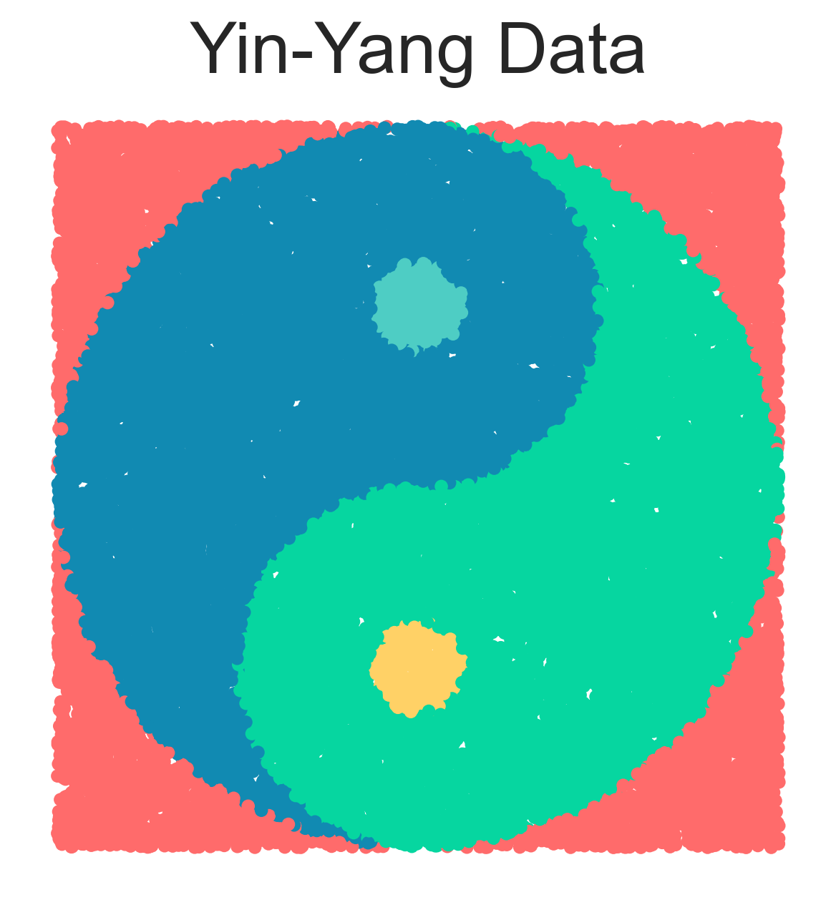
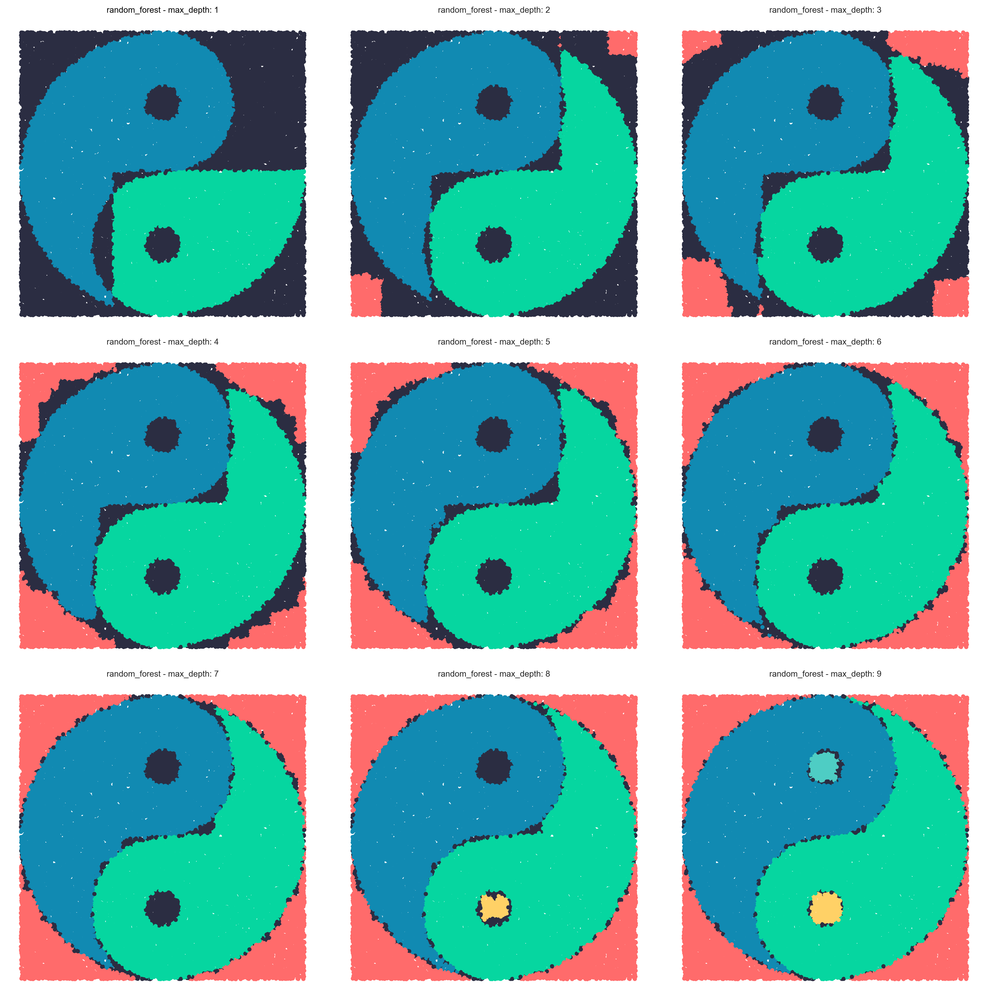
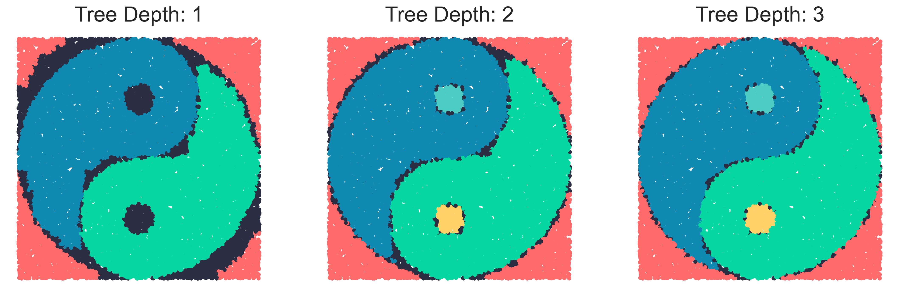
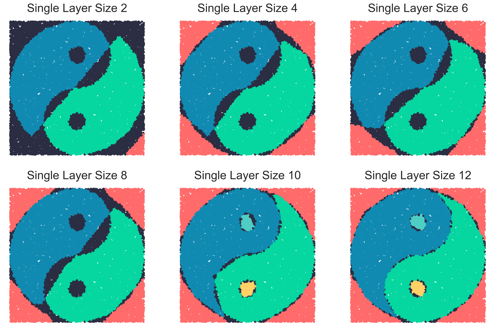
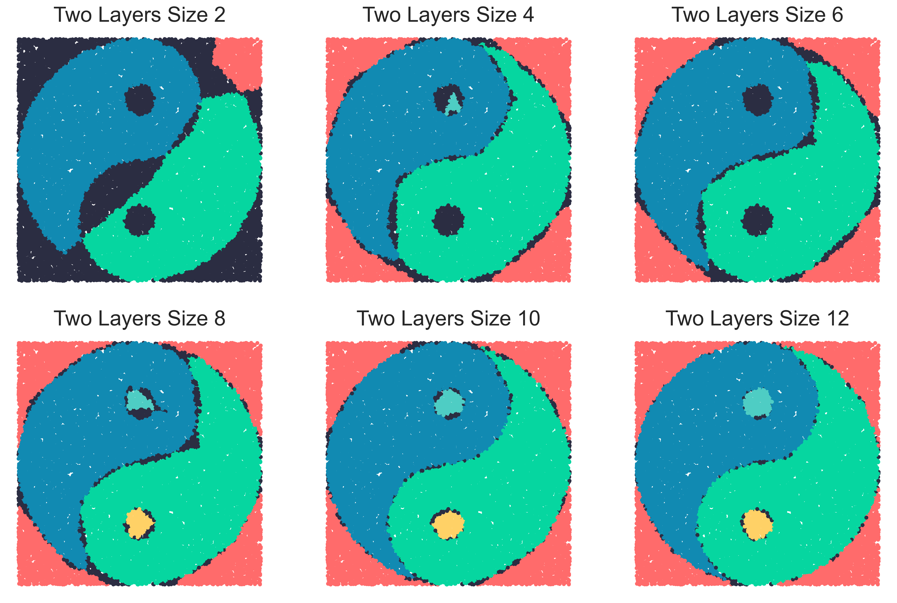
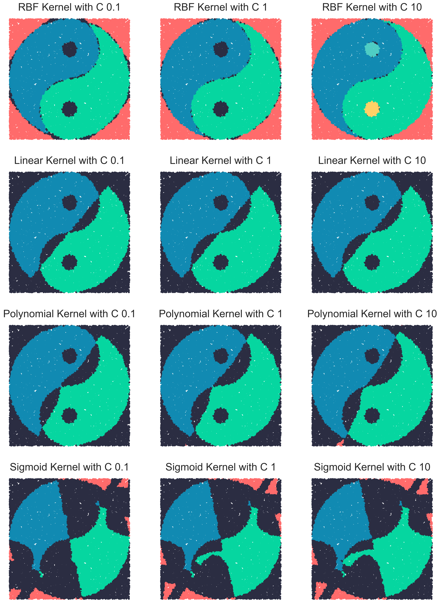
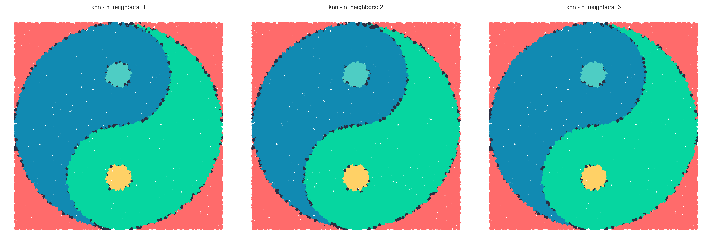
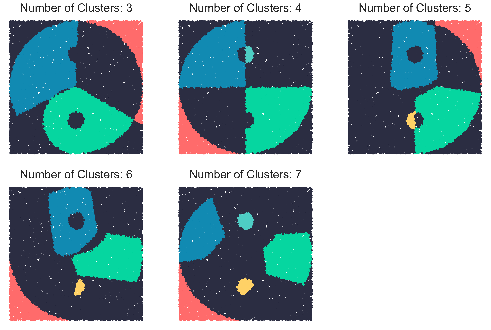
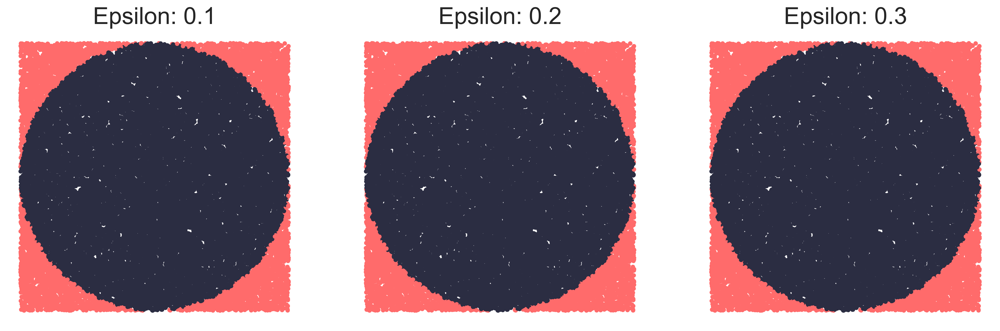

# Yin-Yang Classification

A fun project exploring different machine learning models' ability to classify data in a Yin-Yang shape pattern. This project implements and compares various classification models to understand their performance on this geometrically interesting dataset.

## Dataset Overview

The Yin-Yang dataset presents a visually complex, non-linear classification challenge with intertwined class regions. Its intricate structure challenges models to learn boundaries that are **non-linear, nested, and curved**—making it an excellent benchmark for comparing model expressiveness.

I also came across an interesting paper titled ["The Yin-Yang Dataset"](https://arxiv.org/pdf/2102.08211), which introduces a compact and balanced dataset designed to support research in biologically plausible error backpropagation and deep learning within spiking neural networks.

---

## Models and Results Visualization

### Random Forest Classifier
> _it ain't much but it's honest work_

- **Configuration**: 50 trees, varying `max_depth` from 1 to 9
- **Performance**: Captures most of the points in major classes at lower depths but is able to learn the complete decision boundaries only at depth 9

---
### XGBoost
> _This bad boy can fit so many f**king classes in it_

- **Configuration**: 50 estimators, varying `max_depth` from 1 to 3
- **Performance**: Shows solid performance even at low depths due to gradient boosting’s ability to combine weak learners.

---

### Multi-Layer Perceptron (MLP)

#### MLP with Single Hidden Layer
- **Hidden Units**: 3 to 18
- **Performance**: Starts with baseline performance at low hidden units but improves with more neurons. Still, single-layer MLPs struggle to perfectly model the Yin-Yang’s nested, twisting structure.
  

#### MLP with Two Hidden Layers
- **Hidden Layers**: (2,2) to (12,12)
- **Performance**: Learns the boundaries with lower number of units per layer than MLP with single hidden layer. The second hidden layer allows the network to approximate more complex decision boundaries.

---

### Support Vector Machine (SVM)
- **Configuration**: SVM with `rbf`, `linear`, `poly` and `sigmoid` kernel and vary inverse regularization parameter between 0.1, 1 and 10.
- **Performance**:
  - **RBF kernel** captures the curved boundaries best.
  - **Linear and poly kernels** underperform due to their limited flexibility.
  - **Sigmoid kernel** gives unstable results in this context.
    > _Ew ... brother ew...what's that brother_
  - Very high training time for kernels like RBF.
  

---

### K-Nearest Neighbors (KNN)
- **Neighbors**: 1 to 3
- **Performance**: Despite being simple, KNN performs surprisingly well on this dataset due to its instance-based nature. It handles the swirls of the Yin-Yang reasonably well.

---

### Gaussian Naive Bayes
- **Performance**: Assumption that x and y contribute independently to the probability of a class breaks down in this dataset.

---

### K-Means
- **Number of Clusters**: 3 to 7
- **Performance**: Clustering algorithm not suitable for a highly non-linear classification problem. Accuracy is highest when number of clusters is equal to number of classes.

---

### DBCSAN
> _Why am I even here?_
- **Epsilon**: 0.1 to 0.3
- **Performance**: Density of points is similar throughtout dataset and hence this algorithm is highly unsuitable for this dataset.

---
## Installation and Usage
See [INSTALL.md](INSTALL.md) for detailed installation and usage instructions.
